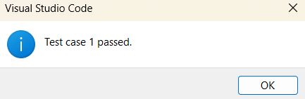

# CPH-VS-Code-Extension-LeetCode

A Visual Studio Code extension offering integrated testing and multi-language support to help you solve LeetCode problems.

## Features

1) Problem Statement & Test Case Fetching:
  Command to fetch problem statement and test cases from LeetCode.
  Input a LeetCode problem URL to automatically retrieve and store test cases locally.

2) Code Writing & Local Testing:
  Write solutions in your preferred programming language(C++ or Python) within the editor.
  Command to run test cases locally, executing them on your solution.

3) Result Comparison & Debugging:
  View detailed results comparing actual outputs against expected outputs for each test case.

## Installation

1) Clone the repository.
(Please keep in mind that you will need to change the directory according to your system.)
2) Install dependencies.
To install the necessary dependencies for this project, run the following command:

```bash
npm install
```

## Usage

1. **Fetch Problem Statement and Test Cases:**
    - User runs the command CPH: Fetch Test Cases.
    - Inputs the LeetCode problem URL.
    - The extension extracts and stores the test cases locally.
2. **Write and Test Code:**
    - Users write their solution in their preferred programming language.
    - Run the command CPH: Run Test Cases to test their solution locally.
3. **View Results:**
    - The extension displays a comparison of actual vs expected outputs for each test case.
    - Highlights discrepancies for debugging.

## Extracting Test Cases

1. Open Command Palette (Ctrl+Shift+P or Cmd+Shift+P on macOS).
2. Type CPH:Fetch Test Cases.
3. Enter the Leetcode Problem URL.
4. Press Enter.

The test cases are fetched and stored in individual txt files.

